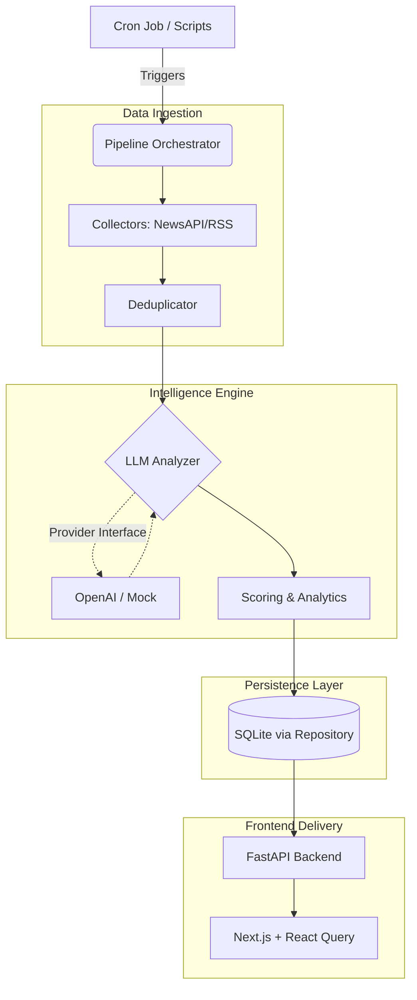
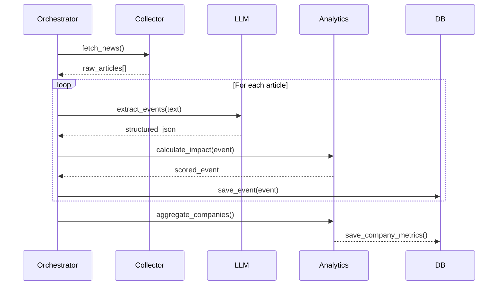

<div align="center">
  <h1>🧠 Strategic Decision Intelligence Platform (SDIP)</h1>
  <p><em>An autonomous AI analyst that collects, scores, and aggregates startup market intelligence.</em></p>
  
  [](https://www.python.org/downloads/)
  [](https://fastapi.tiangolo.com/)
  [](https://nextjs.org/)
  []()
  [](https://opensource.org/licenses/MIT)

  <p align="center">
    <a href="#business-problem">Problem</a> •
    <a href="#features">Features</a> •
    <a href="#architecture">Architecture</a> •
    <a href="#quick-start">Quick Start</a> •
    <a href="#technical-docs">Docs</a>
  </p>
</div>

---

## 🎯 Business Problem

Manual market research is slow, highly subjective, and fragmented. Strategy analysts read hundreds of articles to identify market trends, funding events, and emerging threats, making it difficult to maintain a quantitative, real-time understanding of the startup ecosystem.

**SDIP solves this.** It acts as an autonomous Junior Strategy Analyst. It continuously ingests raw news, classifies articles, uses Large Language Models (LLMs) to extract structured business events (Funding, Layoffs, Acquisitions), scores their impact, and aggregates findings into comprehensive company profiles.

## ✨ Features

- **🤖 Automated Intelligence Pipeline**: Pluggable collectors fetch raw data from RSS and APIs.
- **🧠 LLM Provider Architecture**: Hot-swap between OpenAI, Anthropic, or an offline Mock provider without changing business logic.
- **📊 Quantitative Scoring**: Proprietary algorithms score Companies on Momentum, Risk, and Investment potential based on extracted events.
- **⚡ High-Performance API**: Dependency-injected FastAPI backend with TTL caching ensures sub-10ms response times.
- **💻 React Query Dashboard**: A beautiful, modern Next.js frontend for analyzing the market snapshot and timeline.

## 📸 Dashboard Preview

*(Screenshots to be added. If you deploy the frontend, replace these placeholders with your actual screenshots.)*


*Figure 1: The Main Market Intelligence Dashboard*


*Figure 2: The Automated Business Event Timeline*

## 🏗️ Architecture

SDIP enforces strict architectural boundaries using the **Repository Pattern** and **Provider Pattern**.



### The Intelligence Pipeline Flow



## 🛠️ Tech Stack

- **Backend**: Python 3.10+, FastAPI, Pydantic, RapidFuzz (Deduplication)
- **Frontend**: Next.js 14, React Query, TailwindCSS (assumed)
- **Database**: SQLite (Configured for high read throughput)
- **AI/LLM**: OpenAI GPT-4o-mini (Default) + MockProvider (for testing)
- **Testing**: Pytest (74% Coverage)
- **Linting**: Ruff

## 📂 Repository Structure

```text
.
├── src/
│   ├── analytics/       # Scoring and market aggregation logic
│   ├── api/             # FastAPI routers and dependency injection
│   ├── collectors/      # Data ingestion (NewsAPI, RSS, Mock)
│   ├── database/        # SQLite connection and Repository pattern
│   ├── intelligence/    # Event extraction, Prompts, and Classifiers
│   ├── models/          # Pydantic schemas (BusinessEvent, Record)
│   └── pipeline/        # Orchestrator and LLM Analyzer
├── tests/               # Pytest suites
├── docs/                # System Design, ADRs, and Portoflio Guides
└── README.md
```

## 🚀 Quick Start

SDIP is designed with a **Mock-First Architecture**. You can run the entire pipeline and API locally *without* any API keys.

1. **Clone the repository**
   ```bash
   git clone https://github.com/pratyushmohanty120-bit/startup-intelligence-platform.git
   cd startup-intelligence-platform
   ```

2. **Install Dependencies**
   ```bash
   python -m venv venv
   source venv/bin/activate  # On Windows: venv\Scripts\activate
   pip install -r requirements.txt
   ```

3. **Run the Pipeline (Mock Mode)**
   ```bash
   python -m src.scripts.run_pipeline
   ```
   *This will populate `app.db` with mock intelligence data.*

4. **Start the API Server**
   ```bash
   uvicorn src.main:app --reload
   ```
   *Visit `http://localhost:8000/docs` to view the interactive Swagger UI.*

## 🐳 Deployment (Docker)

To run the production-ready containers:

```bash
docker-compose -f docker-compose.prod.yml up -d
```

*(Note: Ensure you have placed your `.env` file containing `OPENAI_API_KEY` if you wish to run the real AI pipeline instead of the mock.)*

## 📚 Technical Docs

For a deep dive into the engineering decisions, trade-offs, and architecture, see the `/docs` folder:
- [System Design](docs/SYSTEM_DESIGN.md)
- [Engineering Decisions](docs/ENGINEERING_DECISIONS.md)
- [Architecture Decision Records (ADRs)](docs/adr/)
- [Benchmarks](docs/BENCHMARKS.md)

## 🤝 Contributing

We welcome contributions! Please see our [Contributing Guide](CONTRIBUTING.md) and [Code of Conduct](CODE_OF_CONDUCT.md).

## 📄 License

This project is licensed under the MIT License - see the [LICENSE](LICENSE) file for details.