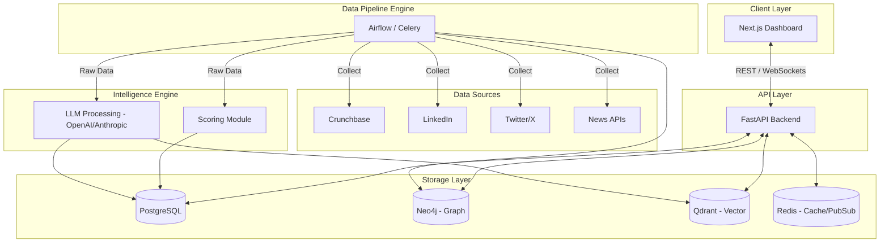

# System Architecture

The Startup Data Intelligence Platform (SDIP) is designed as a modular, highly scalable microservices architecture. This allows for resilient data scraping, intensive AI processing, and a snappy user experience.

## High-Level Design

## Component Breakdown

### 1. Data Pipeline Engine (Apache Airflow / Celery)
Handles the orchestration of data collection tasks. It runs scheduled DAGs to pull data from various sources, handling retries, rate-limiting, and backoffs.

### 2. Intelligence Engine
- **LLM Processing**: Uses large language models to generate text summaries, classify sentiment, and parse unstructured news.
- **Scoring Module**: Applies deterministic and probabilistic models to rank startups based on team strength, momentum, and market size.

### 3. Storage Layer
SDIP uses a polyglot persistence strategy:
- **PostgreSQL**: Stores structured relational data (Users, Startups core details, Financials).
- **Neo4j**: Maps the complex relationships (Founder -> Investor -> Startup -> Competitor).
- **Qdrant**: Stores vector embeddings for semantic search across startup descriptions and news articles.
- **Redis**: Acts as a caching layer for the API and handles WebSocket message brokering for the live feed.

### 4. API Layer (FastAPI)
A high-performance Python backend that serves as the gateway for the frontend. It routes complex queries to the appropriate database and manages authentication/authorization.

### 5. Client Layer (Next.js)
A modern, responsive frontend built with React, Tailwind CSS, and Framer Motion to provide an exceptional user experience.
