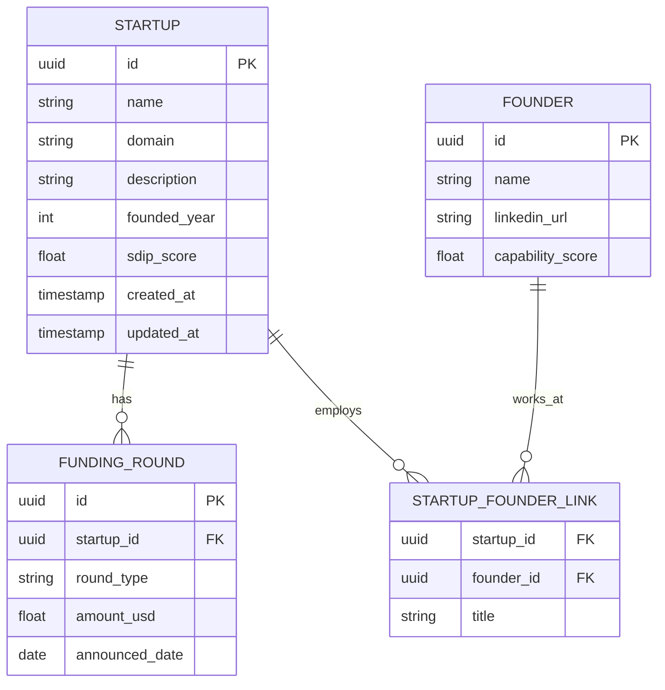

# Database Schema

SDIP uses a polyglot persistence model. This document details the schema for our primary relational store (PostgreSQL) and our graph store (Neo4j).

## PostgreSQL Entity-Relationship Diagram

## Indexes (PostgreSQL)

To ensure snappy API responses, the following indexes are maintained:
- `idx_startup_domain`: B-Tree index on `STARTUP(domain)` for fast lookups by URL.
- `idx_startup_score`: B-Tree index on `STARTUP(sdip_score DESC)` for leaderboard queries.
- `idx_funding_startup`: B-Tree index on `FUNDING_ROUND(startup_id)`.

## Neo4j Graph Schema

Neo4j is used to model complex relationships that are difficult to query in SQL.

**Nodes:**
- `(:Startup {id, name})`
- `(:Person {id, name})`
- `(:Investor {id, name, type})`

**Edges (Relationships):**
- `(:Person)-[:FOUNDED]->(:Startup)`
- `(:Person)-[:WORKED_AT {role, start_date, end_date}]->(:Startup)`
- `(:Investor)-[:INVESTED_IN {round_type, amount}]->(:Startup)`
- `(:Startup)-[:COMPETES_WITH]->(:Startup)`

## Qdrant Vector Store
- **Collection Name**: `startup_embeddings`
- **Vector Dimension**: 1536 (OpenAI standard)
- **Payload**: Contains `startup_id`, `name`, and `sector` for fast pre-filtering during vector search.
