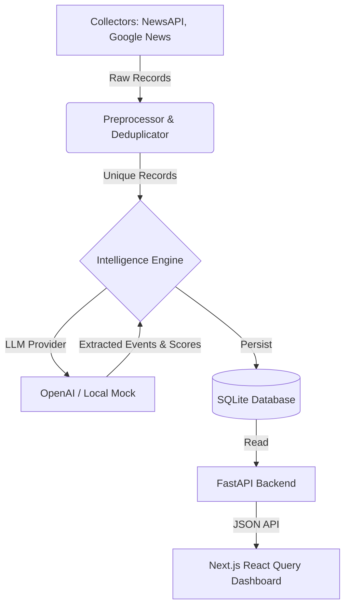

# System Design: Strategic Decision Intelligence Platform (SDIP)

## 1. Problem Statement
Manual startup research is time-consuming, subjective, and fragmented. Analysts read hundreds of articles to identify market trends, funding events, and emerging threats, making it difficult to maintain a quantitative understanding of the startup ecosystem. 

SDIP automates this by acting as a Junior Strategy Analyst. It continuously collects raw news, classifies articles, extracts business events using LLMs, scores impact, and aggregates findings into comprehensive company and market profiles.

## 2. High-Level Architecture

## 3. Technology Choices

### Why FastAPI?
We chose FastAPI over Django or Flask because:
1. **Asynchronous by Default**: Crucial for concurrent I/O operations (like LLM API calls).
2. **Type Safety & Validation**: Pydantic ensures the LLM's unstructured JSON output strictly adheres to our expected data contracts.
3. **Automatic OpenAPI Docs**: Instant Swagger UI accelerates frontend-backend integration.

### Why Next.js & React Query?
- Next.js provides a robust routing architecture for the dashboard.
- React Query handles caching, background polling, and stale-while-revalidate logic out of the box, perfect for an intelligence dashboard where data updates periodically.

### Why SQLite?
- **Zero Configuration**: A single `app.db` file allows recruiters and open-source contributors to spin up the project instantly without managing PostgreSQL containers.
- **Performance**: We use `PRAGMA foreign_keys = ON` and compound indices to ensure blazing fast reads.
- **Mitigating Write Locks**: By centralizing writes within the orchestrator job and keeping the FastAPI layer read-heavy, we avoid `database is locked` errors.

### Why the Repository Pattern?
Decoupling the database (SQLite) from the business logic ensures that the intelligence engine is 100% testable without a real database. It also makes migrating to PostgreSQL or Neo4j trivial in the future.

### Why the Provider Pattern?
We avoid vendor lock-in with LLMs. The `BaseProvider` interface allows us to swap between OpenAI, Anthropic, or an offline `MockProvider` by simply changing an environment variable.

## 4. Scaling Strategy
To scale this to a SaaS enterprise model:
1. **Database**: Swap the SQLite Repository for a PostgreSQL Repository using SQLAlchemy.
2. **Queueing**: Move the Pipeline Orchestrator from a synchronous cron job to a distributed Celery/Redis queue.
3. **Graph DB**: Integrate Neo4j to map complex entity relationships (Founder -> Investor -> Startup).

## 5. Security & Trade-offs
- **API Keys**: Handled strictly via `pydantic-settings`.
- **Mock First**: We trade slightly stale mock data for a 10x improvement in local development speed and deterministic CI/CD pipelines.
